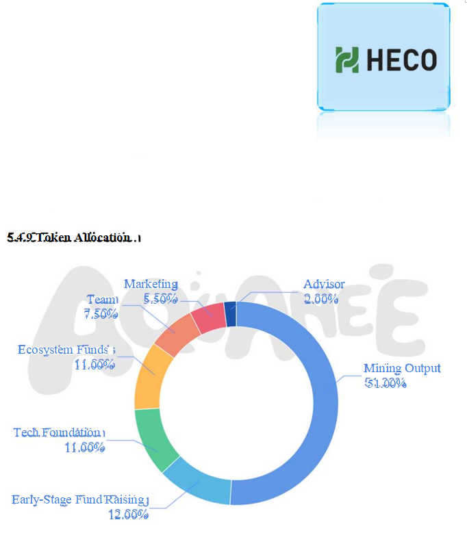

# 5.4.8.1 Blockchain

In the beginning, AQUANEE will be developed on Ethereum to ensure the stability and quick participation of players. After the ecosystem is built, the community will vote to use the AQUANEE public chain to ensure that we can provide the blockchain network with seamless game experiences, fast transactions, and data storage functions.

AQUANEE strives to become the practitioner of decentralized games and further enhance and promote the seamless, cost-effective, and user-friendly game experience of the traditional blockchain.

We will bring AQDC tokens with multi-chain support and in-game NFT (assets).

* Technical introduction

The AQUANEE public chain is a customized and optimized main chain based on Ethereum, and the TPS can reach millions. The optimized public chain has an enhanced DPoS consensus mechanism and supports the digitization and trading of assets other than digital currencies.

AQUANEE will also adopt improved peer-to-peer side-chain technology to support two-way anchoring and mapping of main chain assets to side-chain transactions, and smart contracts compatible with Ethereum smart contracts; support the digitalization of real/virtual world assets, and at the same time have higher security and privacy protection.

* Details

Name： AQDC

Total Supply：	1,000,000,000 AQDC

Initial Circulation Supply：	25250000 AQDC

Smart Contract Support: ERC20 and BEP-20

* NFT Details

In-Game NFT (Asset) Type: AQUA, Skin, and Item

NFT Blockchain Support: Ethereum, Binance Smart Chain, Huobi ECO Chain

Additional NFT Blockchain Support:

N FT Type: Multiple (Limited-Edition and Standard)

All game projects will not collect or track any private keys. No seed phrases will be entered into the game

