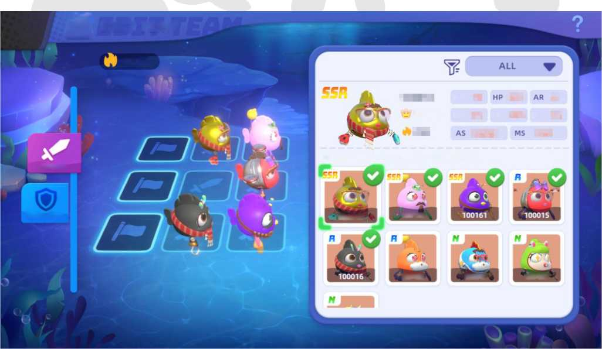

# 3.8 Formation

Players can set up their teams using the AQUAs they own. There are offensive teams and defensive teams that will
help players handle different combat modes. The formation is strategic, and the formation's arrangement impacts the results of the battle.

