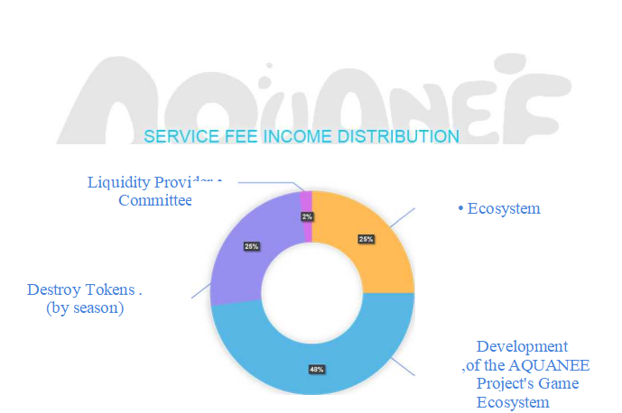

# 5.4.6 Source of Income

. The AQUANEE project will generate revenue from the following sources:

0.25% of the transaction total will be charged as a service fee in DEX, the application currency dealer. Here are the distributions of the service fee income:

