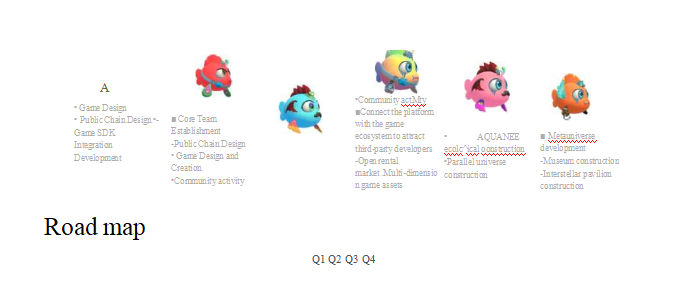

# 5.4.10 Road Map

This document is intended solely for the purpose of communicating to specific recipients who have asked for information about the program and does not constitute any future investment guidance or a contract or commitment of any kind. By participating in the AQDC Token Distribution Project, participants understand and accept the risks of the project and are willing to personally assume all consequences thereof. The project team expressly disclaims any promise of reward or liability for any direct or indirect losses resulting from the project. The AQDC tokens involved in this project are a cryptographic digital code to be used in transactions and do not represent equity, right to earnings or control of the project.

Due to the many uncertainties surrounding the digital currency itself ( including but not limited to the general digital currency regulation in various countries, fierce competition in the industry, and the technical loopholes of the digital currency itself), we cannot guarantee that the project will be successful, and we admit that there is a certain risk of failure of the project, and the tokens of this project are also at risk of becoming invalid. Although the team commits to working hard to solve the problems that may arise in the course of the project, the future will still be beset by uncertainties caused by policies, thus it is important that the support of and participation in this project should be rational and informed by a full understanding of the risks of blockchain.

The AQDC team has set up a foundation entity in Singapore. All operations are in compliance with local laws, regulations and regulatory requirements. In the event that a matter arises that requires legal advice, it is necessary to confirm the handling through a local lawyer. The SSS Foundation maintains the non-profit nature of its operations. Users who participate in the AQDC community have the right to hold further AQDC tokens or relinquish them in the future, regardless of whether or not they have acquired them. Holding a token also implies the 16 holder's right to spend and use smart contracts on the AQDC blockchain platform. AQDC purchasers should understand that the AQDC Foundation makes no guarantee or tunneling, express or implied, to the extent required by law.