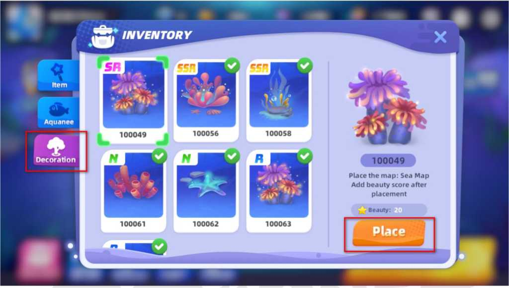

# 3.5.3 Ruin Decorations

There are an array of unique decorations for the territory in the game for players in different stages of civilization. A key feature of the game is buying decorations to decorate your International or Private territories.

Placing different decorations and buildings in each territory will increase the upper limit of Force storage in the territory. Each territory cannot place ornaments and architectural relics indefinitely, because the Force storage of different territories has an upper limit.