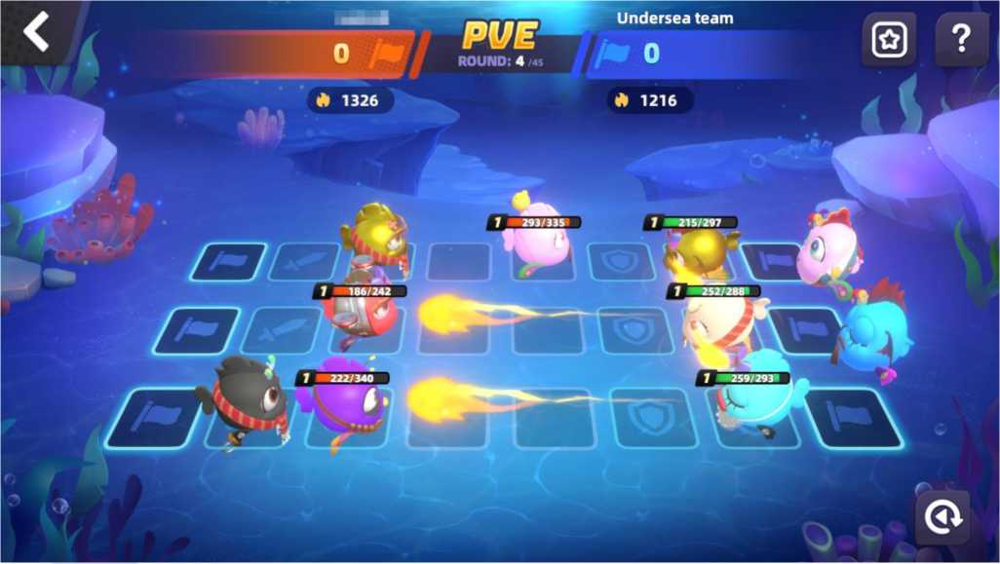

# 3.7.1 PVE

There is a chance that PvE battles will be triggered in the exploration system. When triggering PVE battles, AQUA NPC teams of different difficulty levels will be refreshed and players need to battle them. By defeating NPC teams, players can obtain NEE rewards. The higher the difficulty levels, the more the NEE rewards. The difficulty of the NPC matches the player's power.

