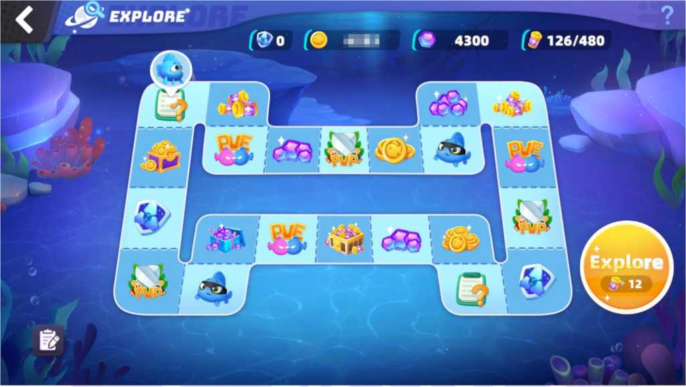

# 3.6 Exploration

Most of the in-game resources are from the exploration system. Exploration requires Force to be spent . The results will be randomly obtained from all the exploration events and the corresponding rewards or battle events will be triggered.

After each AQUA hatches, players can send the AQUA to their territory to obtain energy Force. The more AQUA is invested, the faster the Force will be obtained, but there will be an upper limit. With Force, players can start exploring. When exploring, events will be triggered. There are Player vs Player (PvP) and Player vs Environment (PvE) events. Players can also collect game resources like NEE directly during events.