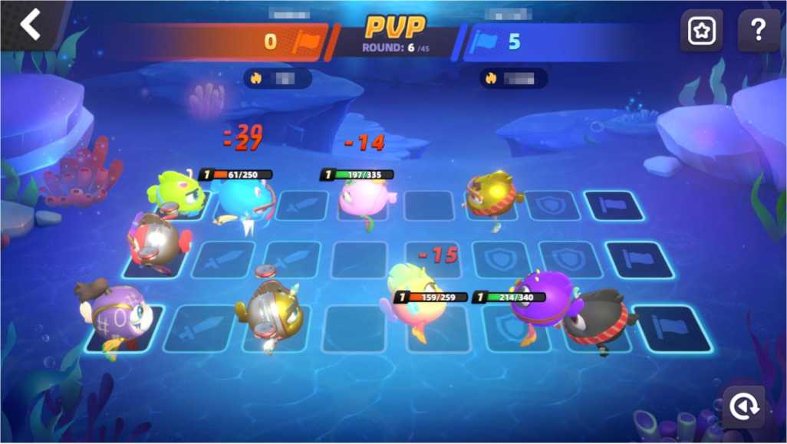

# 3.7.2 PVP

After triggering PVP battles, the system will match players with opponents who have similar rankings. The result of the battle is determined by the formation, strategy, and AQUA power. The system will give some Ocean Stones and ranking points to the winner.At the same time, the opponent will lose a corresponding number of ranking points. The greater the difference in season rankings, the more points earned or deducted the more ranking points will be gained or deducted. However, the point change will not exceed 50 points. However, If the opponent has a shield, the battle will not be triggered, the attacker will be compensated by Ocean Stones, and the defender will deduct 1 shield. The seasonal world ranking will be decided by the ranking points. After the season ends, the rewards of NEE will be distributed based on the leaderboard ranking.

